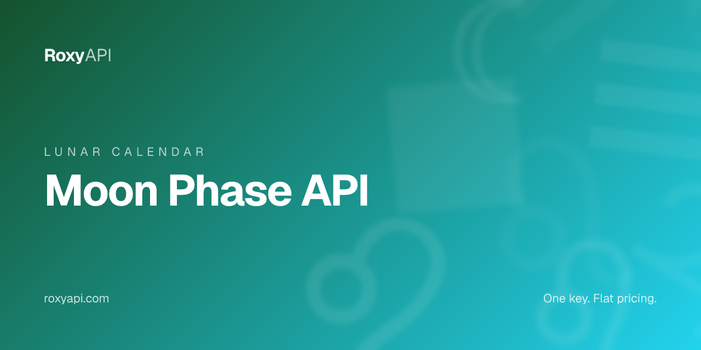

[](https://roxyapi.com/products/astrology-api)

# Moon Phase API

> Current moon phase with illumination, lunar age, zodiac sign, and degree, plus upcoming phases and a full lunar calendar. One key covers 12+ spiritual domains. MCP-first, no local setup required.

[](https://roxyapi.com/pricing)
[](https://roxyapi.com/api-reference)
[](https://roxyapi.com/methodology)
[](https://roxyapi.com/docs/mcp)
[](https://roxyapi.com/docs/sdk)

## What is Moon Phase API

The RoxyAPI moon phase endpoint returns the current lunar phase with illumination percentage, lunar age in days since the new moon, the tropical zodiac sign the Moon occupies, its degree, and distance from Earth. Phase names cover the full lunar cycle from New Moon through Waxing Crescent, First Quarter, Waxing Gibbous, Full Moon, Waning Gibbous, Last Quarter, and Waning Crescent. Each call can also return a moon phase meaning with energy direction and keywords, ideal for moon tracking apps, lunar calendars, and astrology widgets. One RoxyAPI subscription covers 12+ spiritual domains, all positions powered by Roxy Ephemeris, verified against NASA JPL Horizons.

## Why this API

| Property | Value |
|----------|-------|
| Coverage | 12+ spiritual domains in one subscription |
| Calculation | Roxy Ephemeris, verified against NASA JPL Horizons |
| MCP server | `https://roxyapi.com/mcp/astrology` (Streamable HTTP, no local setup) |
| SDKs | TypeScript on npm `@roxyapi/sdk`, Python on PyPI `roxy-sdk`, PHP on Packagist `roxyapi/sdk`, C# on NuGet `RoxyApi.Sdk`, Go `github.com/RoxyAPI/sdk-go`, WordPress plugin `roxyapi` |
| Pricing | One key, flat per call, $39 for 25K calls |
| Licensing | Personal and commercial use, including closed source apps. No AGPL or GPL entanglement. [Full terms](https://roxyapi.com/policy/license) |
| Last verified | 2026-Q3 |

## Quick start

1. Get a key at [roxyapi.com/pricing](https://roxyapi.com/pricing)
2. Pick a language below
3. Copy the snippet, run, ship

### cURL

```bash
# Current moon phase. Defaults to today at noon UTC.
curl -s "https://roxyapi.com/api/v2/astrology/moon-phase/current" \
  -H "X-API-Key: $ROXY_API_KEY"

# Specific date with a timezone offset for a localized lunar calendar day
curl -s "https://roxyapi.com/api/v2/astrology/moon-phase/current?date=2026-05-31&timezone=5.5" \
  -H "X-API-Key: $ROXY_API_KEY"
```

### Python

```python
import os
from roxy_sdk import create_roxy

roxy = create_roxy(os.environ["ROXY_API_KEY"])

# Current moon phase. All query params optional, defaults to today at noon UTC.
moon = roxy.astrology.get_current_moon_phase()

print(moon["phase"])          # Full Moon
print(moon["illumination"])   # 99.8
print(moon["age"])            # 14.89
print(moon["sign"])           # Sagittarius
print(moon["degree"])         # 11.54
print(moon["meaning"]["keywords"])  # ['harvest', 'illumination', 'clarity', ...]
```

### JavaScript (Node)

```js
import { createRoxy } from '@roxyapi/sdk';

const roxy = createRoxy(process.env.ROXY_API_KEY);

// Current moon phase with illumination, lunar age, zodiac sign, and degree
const { data, error } = await roxy.astrology.getCurrentMoonPhase();

if (error) throw new Error(error.error);

console.log('Phase:', data.phase);                // Full Moon
console.log('Illumination:', data.illumination);  // 99.8
console.log('Lunar age:', data.age);              // 14.89
console.log('Sign:', data.sign);                  // Sagittarius
console.log('Degree:', data.degree);              // 11.54
```

### TypeScript

```ts
import { createRoxy } from '@roxyapi/sdk';

const roxy = createRoxy(process.env.ROXY_API_KEY!);

// Moon phase: returns phase, illumination, age, sign, degree, distance, and phase meaning
const { data, error } = await roxy.astrology.getCurrentMoonPhase({
  query: { date: '2026-05-31', timezone: 5.5 },
});

if (error) throw new Error(error.error);

console.log('Phase:', data.phase);
console.log('Illumination:', data.illumination, '%');
console.log('Lunar age:', data.age, 'days');
console.log('Sign:', data.sign);
console.log('Keywords:', data.meaning?.keywords);
```

## Request schema

All parameters are query string and optional.

| Field | Type | Required | Description |
|-------|------|----------|-------------|
| `date` | string (query) | no | Date in YYYY-MM-DD format. Defaults to today if omitted. |
| `time` | string (query) | no | Time in 24-hour HH:MM:SS format. Defaults to 12:00:00 (noon). Moon moves ~13 degrees per day so time affects phase precision. |
| `timezone` | number or string (query) | no | Decimal hours (e.g. 5.5 for IST, -5 for EST) OR IANA name (e.g. "Asia/Kolkata"). IANA resolved to the DST-correct offset for the given date. Defaults to 0 (UTC). |
| `lang` | string (query) | no | Interpretation language. Supported: en, tr, de, es, hi, pt, fr, ru. Defaults to en. |

## Response shape

```json
{
  "date": "2026-05-31",
  "phase": "Full Moon",
  "illumination": 99.8,
  "age": 14.89,
  "sign": "Sagittarius",
  "degree": 11.54,
  "distance": 406195,
  "meaning": {
    "name": "Full Moon",
    "symbol": "🌕",
    "description": "The full moon is also known as the harvest moon, and as the name suggests, it is a time to receive the gifts of your past intentions and your current cycle. From this period, the moon will go from waxing to waning, signaling a journey to look inward instead of out. Emotions and awareness are heightened, and clarity about what serves you becomes undeniable.",
    "keywords": ["harvest", "illumination", "clarity", "culmination", "celebration"],
    "energy": "full",
    "illumination": "100% (Fully Illuminated)"
  }
}
```

| Field | Type | Description |
|-------|------|-------------|
| `date` | string | Date of this moon phase calculation (YYYY-MM-DD). |
| `phase` | string | Current lunar phase name. One of: New Moon, Waxing Crescent Moon, First Quarter Moon, Waxing Gibbous Moon, Full Moon, Waning Gibbous Moon, Last Quarter Moon, Waning Crescent Moon. |
| `illumination` | number | Moon illumination percentage (0-100). 0 = New Moon, 100 = Full Moon. |
| `age` | number | Lunar age in days since the last New Moon. Full lunation cycle is ~29.53 days. |
| `sign` | string | Tropical zodiac sign the Moon currently occupies. |
| `degree` | number | Degree of the Moon within its current zodiac sign (0-29.999). |
| `distance` | number | Distance from Earth to the Moon in kilometers. |
| `meaning` | object | Moon phase meaning and astrological interpretation. Includes energy direction, keywords, and guidance for this lunar phase. Optional. |
| `meaning.name` | string | Moon phase display name. |
| `meaning.symbol` | string | Moon phase emoji symbol. |
| `meaning.description` | string | Astrological interpretation of this lunar phase and its influence on activities, emotions, and intentions. |
| `meaning.keywords` | array | Key themes and activities aligned with this moon phase. |
| `meaning.energy` | string | Lunar energy direction: waxing (building), waning (releasing), new (beginning), or full (culmination). |
| `meaning.illumination` | string | Illumination range description for this phase. |

## Common use cases

| Use case | Endpoint flow |
|----------|---------------|
| Moon tracking app home screen | GET `/astrology/moon-phase/current`, surface `phase`, `illumination`, and `meaning.symbol` |
| Lunar calendar for a content site | GET `/astrology/moon-phase/calendar/{year}/{month}` to render every day of the month |
| Full moon and new moon push reminders | GET `/astrology/moon-phase/upcoming` overnight, schedule local-time delivery on transition dates |
| Gardening by moon phase tool | GET `/astrology/moon-phase/current`, branch logic on `energy` (waxing vs waning) |
| Astrology widget with moon sign | GET `/astrology/moon-phase/current`, surface `sign` and `degree` for the Moon position |

## Related endpoints in this domain

- `GET /astrology/moon-phase/upcoming` (`getUpcomingMoonPhases`) - next New Moon, First Quarter, Full Moon, and Last Quarter transition dates for lunar event calendars
- `GET /astrology/moon-phase/calendar/{year}/{month}` (`getMoonCalendar`) - complete lunar calendar with phase and illumination for every day of a month
- `GET /astrology/horoscope/{sign}/daily` (`getDailyHoroscope`) - daily transit forecast by zodiac sign with Moon sign, Moon phase, and energy rating

## Use this in your AI agent

Connect Claude, GPT, Gemini, or Cursor to RoxyAPI through the remote MCP server. No Docker. No self hosting. The full MCP tool catalog for this domain is at `https://roxyapi.com/mcp/astrology`.

```json
{
  "mcpServers": {
    "astrology": {
      "url": "https://roxyapi.com/mcp/astrology",
      "headers": { "X-API-Key": "$ROXY_API_KEY" }
    }
  }
}
```

See [docs/mcp](https://roxyapi.com/docs/mcp) for Claude Desktop, Cursor, Windsurf, VS Code, and Claude Code setup.

## For AI coding agents

This repo ships an [AGENTS.md](AGENTS.md) execution playbook. Cursor, Claude Code, Aider, Codex, Windsurf, RooCode, and Gemini CLI will pick it up automatically. Top level overview lives at [roxyapi.com/AGENTS.md](https://roxyapi.com/AGENTS.md).

## Resources

- [Methodology and gold standard tests](https://roxyapi.com/methodology) verified against NASA JPL Horizons
- [Full API reference](https://roxyapi.com/api-reference) interactive Scalar UI
- [TypeScript SDK on npm](https://www.npmjs.com/package/@roxyapi/sdk)
- [Python SDK on PyPI](https://pypi.org/project/roxy-sdk/)
- [PHP SDK on Packagist](https://packagist.org/packages/roxyapi/sdk)
- [C# SDK on NuGet](https://www.nuget.org/packages/RoxyApi.Sdk)
- [Go SDK on pkg.go.dev](https://pkg.go.dev/github.com/RoxyAPI/sdk-go)
- [WordPress plugin](https://wordpress.org/plugins/roxyapi/)
- [llms.txt](https://roxyapi.com/llms.txt) full LLM citation index
- [Top level AGENTS.md](https://roxyapi.com/AGENTS.md)

## Other RoxyAPI samples

[](https://github.com/RoxyAPI/kp-astrology-api)
[](https://github.com/RoxyAPI/kundli-api)
[](https://github.com/RoxyAPI/daily-horoscope-api)
[](https://github.com/RoxyAPI/panchang-api)
[](https://github.com/RoxyAPI/biorhythm-api)

## License

MIT for this sample repo. See [LICENSE](LICENSE).

**Catalog licensing:** Personal and commercial use, including closed source proprietary apps. No AGPL or GPL entanglement. RoxyAPI APIs and SDKs are safe to embed in commercial products. Full terms at [roxyapi.com/policy/license](https://roxyapi.com/policy/license).

## Contact

- Site: [roxyapi.com](https://roxyapi.com)
- Status: [roxyapi.com/api-reference](https://roxyapi.com/api-reference)
